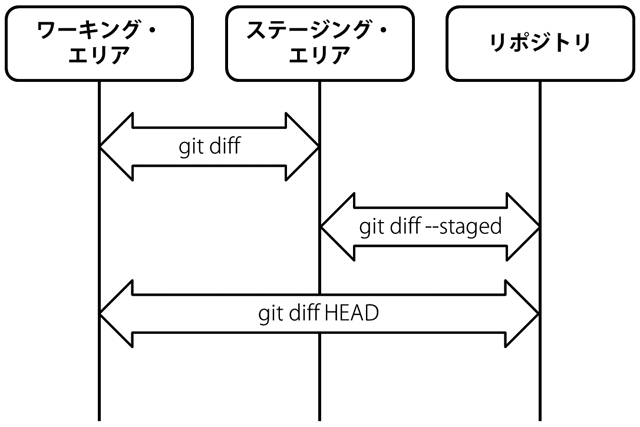

# Commands

## 使い始める
### git config
まずはGitに対して自己紹介をしましょう。commitオブジェクトができることは前述した通りです。そのとき、「誰が」commitしたのかを設定するのです。

```
% git config --global user.name treby
% git config --global user.email treby@atelier-nodoka.net
```

こうすることで、ホームディレクトリ以下の`.gitconfig`ファイルに次の内容が書き込まれます。

```
% cat ~/.gitconfig
[user]
	name = treby
	email = treby@atelier-nodoka.net
```
ここで設定した情報は、コミットに含まれます。

```
% git log --reverse
commit dacc936975dde6a1c83db7f853e7dc0ef3d6da4e
Author: treby <treby@atelier-nodoka.net>
Date:   Sat Jun 7 16:24:40 2014 +0900

    Initial commit.
```

他にも、`git config`コマンドでは、いろいろな設定が行えます。たとえば、(Thumb.dbや.DS_Storeなど)Gitの管理対象外としたいファイルがある場合は、

```
% echo 'Thumb.db' > ~/.gitignore
% echo '.DS_Store' >> ~/.gitignore
% git config --global core.excludesfile '~/.gitignore'
```

のようにしてあらかじめ設定することが可能です。

### git init
今いるディレクトリ以下のファイルをgit管理下におくコマンドです。
例えば今、CSSファイルとJSファイル、そして単一のページを持つシンプルなWebページがあるとします。

```
% cd public_html
% tree --dirsfirst
.
├── css
│   └── style.css
├── js
│   └── index.js
└── index.html
```
ここで、`git init`コマンドを実行することでこれら全てのファイルをGit管理下におくことができます(リポジトリが作成されます)。

```
% ls -a
.          ..         css        index.html js

% git init
Initialized empty Git repository in /Users/treby/Documents/sample-git/.git/

% ls -a
.          ..         .git       css        index.html js
```

ちなみに`.git`ディレクトリの下は次のようになっています。

```
% tree .git
.git
├── HEAD
├── branches
├── config
├── description
├── hooks
│   ├── applypatch-msg.sample
│   ├── commit-msg.sample
│   ├── post-update.sample
│   ├── pre-applypatch.sample
│   ├── pre-commit.sample
│   ├── pre-push.sample
│   ├── pre-rebase.sample
│   ├── prepare-commit-msg.sample
│   └── update.sample
├── info
│   └── exclude
├── objects
│   ├── info
│   └── pack
└── refs
    ├── heads
    └── tags
```

## 歴史を保存する
まずは、基本的なコマンド類について説明します。
先ほどの`git init`コマンドを実行しただけではまだリポジトリ保存されていません。

このことは`git status`コマンド(後述)を使って確認することができます。

```
% git status
On branch master

Initial commit

Untracked files:
  (use "git add <file>..." to include in what will be committed)

	css/
	index.html
	js/

nothing added to commit but untracked files present (use "git add" to track)
```
`git add`コマンド`git commit`コマンドを使って、リポジトリに歴史を保存しましょう。

### git add
ワーキングツリーに行った変更をステージング・エリアに反映するためのコマンドです。

`index.html`の変更をステージング・エリアに反映させるには、`git add index.html`のように指定します。

```
% git add index.html
% git status
On branch master

Initial commit

Changes to be committed:
  (use "git rm --cached <file>..." to unstage)

	new file:   index.html

Untracked files:
  (use "git add <file>..." to include in what will be committed)

	css/
	js/
```

また、カレントディレクトリ以下のファイル全てを追加するには、`git add .`と指定すれば良いでしょう。

```
% git status
On branch master

Initial commit

Changes to be committed:
  (use "git rm --cached <file>..." to unstage)

	new file:   css/style.css
	new file:   index.html
	new file:   js/index.js
```

### git commit
ステージング・エリアにある変更をリポジトリに反映します。`-m`オプションをつけて、コメントを記述します。

```
% git commit -m 'Initial commit.'
[master (root-commit) 47bec42] Initial commit.
 3 files changed, 0 insertions(+), 0 deletions(-)
 create mode 100644 css/style.css
 create mode 100644 index.html
 create mode 100644 js/index.js
```

ちなみにワーキング・エリアに加えた修正(新規ファイルの追加除く)を全て`git add`し、`git commit`するのであれば、`git commit -am`の一コマンドで実行することが可能です。

```
% edit index.html
% git status
On branch master
Changes not staged for commit:
  (use "git add <file>..." to update what will be committed)
  (use "git checkout -- <file>..." to discard changes in working directory)

	modified:   index.html

no changes added to commit (use "git add" and/or "git commit -a")

% git commit -am 'Second commit.'
[master a7ffd6b] Second commit.
 1 file changed, 6 insertions(+)
```

### git reset
ステージング・エリアの参照を設定し直します。
一度ステージング・エリアに反映した変更を取り消す際などに使用します。

```
% git status
On branch master
Untracked files:
  (use "git add <file>..." to include in what will be committed)

	detail.html

nothing added to commit but untracked files present (use "git add" to track)

% git add detail.html

% git status
On branch master
Changes to be committed:
  (use "git reset HEAD <file>..." to unstage)

	new file:   detail.html

% git reset

% git status
On branch master
Untracked files:
  (use "git add <file>..." to include in what will be committed)

	detail.html
```

下記のような感じに履歴を残さずに歴史を書き換えることが可能です。

```
% git log --oneline
849072f Add detail.html
a7ffd6b Second commit.
733b329 Initial commit.

% git reset a7ffd6b

% git log --oneline
a7ffd6b Second commit.
733b329 Initial commit.
```

### git rm
ファイルを削除する際に使用します。

```
% git rm <ファイル名>
```

### git mv
ファイル名を明示的に変更する際に使用します。

```
% git mv <現在のファイル名> <変更したいファイル名>
```

## 状態を確認する

### git status
現在のワーキング・ツリーの状態を表示します。


### git log
リポジトリの履歴を表示します。


## ブランチを利用する

### git branch
ブランチの一覧を表示したり、新しくブランチを作成したりします。

### git checkout
ブランチの切り替えを行います。

### git merge
ブランチとブランチを統合します。

## 歴史を変更する

### git rebase
歴史を書き換えることができます。

## ネットワークを利用する
### git remote
リモートリポジトリを確認したり、設定したりできます。

### git clone
すでにあるリポジトリを手元に持ってくることができます。

### git fetch
リモートリポジトリの変更をローカルリポジトリにダウンロードします。

### git pull
`git fetch`と`git merge`を同時に行います。

### git push
ローカルリポジトリの変更をリモートリポジトリに反映します。

### 共同で開発を進める際の注意点
ここまで、`git rebase`や`git reset`を使って変更を取り消したり、歴史をきれいにしたりする方法を紹介しましたが、これらは過去のコミットを書き換える行為にあたります。

基本的には、リモートリポジトリに変更を適用した時点で**歴史は前に進めるしかない**ことを留意していただければと思います。

あくまで`git rebase`は個人で開発しているうちに使うものです。

## その他のコマンド・機能

### git diff
ファイルの変更を表示するコマンドです。diffにもいくつか前に書いた種類があります。それぞれの違いを知る上で、先述した3つの状態を参考にすると分かりやすいかと思います。

- `git diff`
  - ステージング・エリアとワーキングツリーの間の差分を表示します。
- `git diff --staged`
  - ステージング・エリアとリポジトリの間の差分を表示します。
- `git diff HEAD`
  - ワーキング・エリアとリポジトリの間の差分を表示します。

[](../assets/git_diff.png)

### git cherry-pick
あるコミットの変更を現在のブランチに反映します。

### git revert
あるコミットを打ち消すコミットを作成します。

### git stash
ワーキング・エリアの変更を一時的に取り除きます。

### .gitignore
Gitを使う上でThumb.dbや.DS_StoreといったOS依存のファイルやプログラムをビルドする際にできる出力ファイルなど、Gitに管理させたくないファイルを明示的に除外することができます。

ディレクトリ以下に`.gitignore`ファイルを作成して、一行に一つ無視したいファイルを指定するほか、`git config core.excludesfile <パス>`で無視したいファイルを羅列したファイルを指定することができます。

### submodule
ライブラリなどをプロジェクトの一部として、commitの参照として持つことができます。
