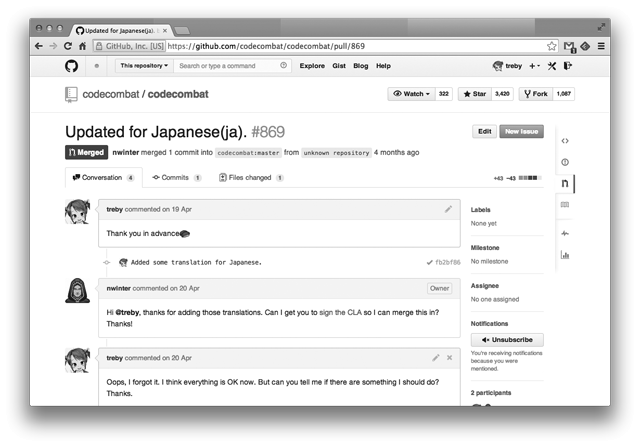

# Contribution

次は、既に存在するプロジェクトの開発に参加する方法について解説します。

## 開発を始める

### リポジトリをForkする

開発に参加したいプロジェクトの右上にあるForkボタンを選択します。すると、自分のリモートリポジトリ上にオリジナルのリポジトリのコピーが作成されます。

### ローカルリポジトリにcloneする

コードに変更を加えるためにリモートリポジトリからcloneを行いましょう。

clone元のリモートリポジトリをどうするのかのやり方はいろいろあるのですが、筆者個人としては慣例的に、

- origin  …… 自分のリモートリポジトリ
- upstream …… オリジナルのリモートリポジトリ

とすることが多いです。ここで、originという名前はGitでデフォルトで使われるリモートホストの別名ですが、upstreamは便宜上使っているリモートホストの別名です。故、upstreamでなくとも何でも構いません。このフローを採用する場合は

```
% git clone git@github.com:treby/codecombat.git
% cd codecombat
% git remote add upstream git@github.com:codecombat/codecombat.git
```

のように設定を行います。この時、設定は以下のようになっています。

```
% git remote -v
origin	git@github.com:treby/codecombat.git (fetch)
origin	git@github.com:treby/codecombat.git (push)
upstream	git@github.com:codecombat/codecombat.git (fetch)
upstream	git@github.com:codecombat/codecombat.git (push)
```

(例として[https://github.com/codecombat/codecombat](https://github.com/codecombat/codecombat)のプロジェクトをcloneすることを考えています)

一方オリジナルの

- origin  …… オリジナルのリモートリポジトリ
- self …… 自分のリモートリポジトリ

のようにしたい場合は以下の手順を踏むことになるでしょう。

```
% git clone git@github.com:codecombat/codecombat.git
% cd codecombat
% git remote add self git@github.com:treby/codecombat.git
```

このとき、設定値は以下のようになっているはずです。

```
% git remote -v
origin	git@github.com:codecombat/codecombat.git (fetch)
origin	git@github.com:codecombat/codecombat.git (push)
self	git@github.com:treby/codecombat.git (fetch)
self	git@github.com:treby/codecombat.git (push)
```

もちろん`git remote rename`コマンドを使えば後から変更できることなので、深く考える必要はありませんが、自分がどのようなやり方を選択したかを意識できると良いと思います。(以後、オリジナルのリモートホスト名を`upstream`、自分のリモートホスト名を`origin`としているとします)

## コードの変更を行う
コードのcloneがリモートリポジトリの設定が完了したら早速作業を開始しましょう。

### 修正用のブランチを作成する
まずは、何はともあれ、開発用のbranchを作成しましょう。ブランチ名は行いたい変更を端的に表すものが好ましいです。

```
% git checkout -b update_ja_resource_file
```

あとは普段通り、コードの変更をすすめ、コミットを行います。

### 最新の状態を保つ

開発開始から時間が経った場合など、ローカルリポジトリがオリジナルのリモートリポジトリに比べて古くなってしまうことが多々あります。

そのような場合は、最新の情報をとってきましょう

```
% git checkout master
% git pull upstream master
```

お好みで自分のリモートリポジトリも更新してもよいかもしれません。

```
% git push origin master
```

また、まだリモートリポジトリにpushしていないのであればrebaseするということも考えられます。

```
% git checkout update_ja_resource_file
% git rebase master
```

もちろん、自分のリモートリポジトリにpushしているだけのコミットであれば、rebaseを行った後にforced push(`git push -f`)を行うこともできますが、あまり好ましくないかもしれません(通常は問題になりませんが、誰かがあなたの自分用リモートリポジトリの該当ブランチを使って作業していた場合におかしなことになるかもしれません)。

## コードの変更を共有する
### 変更をpushする
コードの修正が完了したら、変更を自分のリモートリポジトリに反映しましょう。

```
% git push origin
```

こうすることでGitHubのWebUI上で変更が見えるようになります。

### Web上でPull Requestを作成する

最後にオリジナルのリポジトリに対して変更を取り入れてもらうために、Pull Requestを作成します。

先ほど変更を行った最後の確認を行い、Send Pull Requestボタンをおします。

[](../assets/gh_pr.png)

### レビューと修正

ちゃんと更新が行われているプロジェクトであれば、commit権限がある方がレビューしてくださり、問題なさそうであればMergeしてもらえると思います。レビューの結果、さらに変更の必要があった場合は、変更を同じブランチに対して行い、自分のリモートリポジトリに対してpushすれば、Pull Requestにも自動で変更が反映されます。
