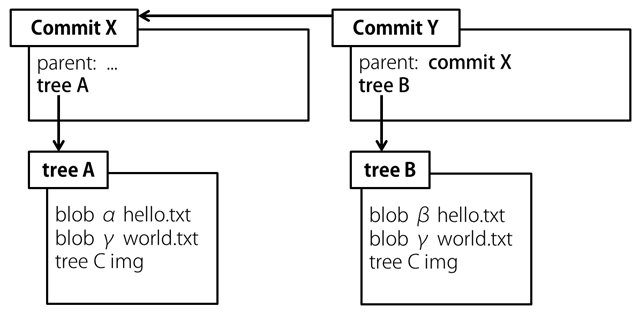
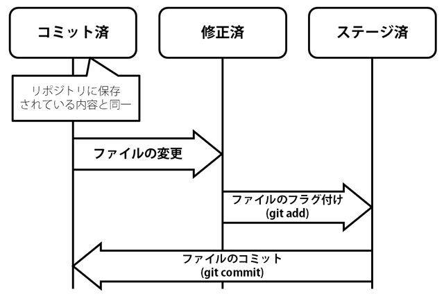

# About Git
既に述べた通り、Gitは分散型のVCSの一種です。ここでは、そんなGitの基本概念とデータ構造をさらに掘り下げていきます。

## Gitの基本的な仕組み
まず、履歴だとかそういうことを考えずに、純粋にGitがどのようにしてファイルを保持しているかを説明しましょう。

SVNなど、多くのVCSでは履歴を保存する際、その差分のみを保存する実装がとられています。つまり、実際のファイルとしては一番最初のものだけをもっておき、あとは一つ一つ変更の差分を保持するという考え方です。歴史の一番はじめからの差分を素直に全て適用すればそこから最新の状態にできるというわけです。

対してGitでは、差分を保存するのではなくプロジェクトの構造そのものを記録しています。「履歴情報」はプロジェクト構造(を表す情報)のチェインとして扱われます。

つまり、一番最初の情報が欠落していようとも、最新のプロジェクト構造を表すファイル群が存在していれば最新の状態を復元することができるのです(もちろんそのままでは情報が欠落している時の状態は復元できないことになりますが……)。

もちろん、差分のみを保存する実装に比べ必要となるディスク容量が増えてしまうという側面はありますが、その分シンプルな実装を実現しています。

### プロジェクト構造を表すオブジェクト
実際にはGitにおいては全てのものをオブジェクトとして保存します。オブジェクトは内容と簡単なヘッダ情報をSHA-1ハッシュ化した40桁の文字列で表されます。

プロジェクト構造を表す上では主にblobとtreeといったオブジェクトが使われます。

blobはファイルそのものを表します。ファイルの内容と簡単なヘッダ情報をSHA-1ハッシュ化したものが該当のblobオブジェクトの名前となります。

```
% git hash-object README.md
14394a840b547484bee11204eec574b016de3475

% cat README.md | git hash-object --stdin
14394a840b547484bee11204eec574b016de3475
```

treeはディレクトリを表します。treeの中に含まれるオブジェクト(blobやtreeなど)の名前とアクセス権オブジェクト名のリストをヘッダ情報とともにSHA-1ハッシュ化したものです。

```
% git ls-tree HEAD
100644 blob d6ccc87cb452e584b97b1756e9c98746a1d4a857	README.md
040000 tree a56db0b366e520cc66088bf157313baa7a674413	js
040000 tree 7970b0be1d5699381dfe953c16a9f530cfde592a	json
040000 tree 96504e5f7b4a065cc4723c736dcdef6c1e5778d4	tools
```

多少の例外はありますが、プロジェクトの構造はこのtreeとblobで表すことができます。一意の時点のプロジェクトの構造を表したい時はバージョン管理を行いたい最上位のディレクトリ(プロジェクトルート)のtreeオブジェクトのオブジェクト名を指定すれば良いのです。

### 履歴情報を表すオブジェクト
一意の状態はプロジェクトルートのtreeオブジェクト名で表せることは前述した通りです。履歴情報とはすなわち、プロジェクト構造の一連のつながりと考えることができます。

Gitにおいて履歴そのものはcommitというオブジェクトで管理されます。commitには、作成時点のプロジェクトルートのtreeオブジェクト名と、親となるcommitオブジェクトそして記録を行ったユーザの情報、コメントの情報が含まれます。

```
% git cat-file -p HEAD
tree 7124d4fb81e8b369fd45dc028c890494d248f81d
parent 733b329d87811985b1bda38231416a8d9347afce
author treby <treby@atelier-nodoka.net> 1406913714 +0900
committer treby <treby@atelier-nodoka.net> 1406913714 +0900

Second commit.
```

元のプロジェクトルートのtreeオブジェクト名をA、修正後のプロジェクトルートtreeオブジェクト名をBとすれば、BとひもづいたcommitオブジェクトYは、AとひもづいたcommitオブジェクトXの子として表すことができるわけで、これの繰り返しで一連の歴史を表すことができるようになります。

[](../assets/commit.png)

### 系統を表す仕組み

さて、個人で作業する際はあまり意識をしませんが、複数人で作業するときなどは同じ親を持つ複数の系統があった方が便利なことが多々あります。複数人で作業を行う際に系統が一本のみだと、変更している部分は異なるのに、いざそれぞれの変更を統合しようとした際にどうすれば良いのか分からなくなってしまうからです。

もちろん、作業をしている人の間で変更を行うタイミング等を共有して、同じタイミングでcommitを行わない、他の人がcommitしたらそのcommitを取り込んだ上で作業を進める等のやり方をすれば上記の問題は解決できないこともないのですが、あまりスマートなやり方ではありません。

このような問題をVCSでは系統を分けることによって解決します。そしてこの系統を分ける仕組みをbranchと呼びます。

Gitにおいてはbranchはcommitオブジェクトの参照という形で表します。commitオブジェクトへの「参照」ですので当然新しくcommitを行うと、branchの参照も切り替わるようになっています。

分岐したbranchの統合はmergeという作業で行います。異なる二つ以上のcommitを統合するため、作成されるcommitは2つ以上のcommitを親として持ちます。

```
% git cat-file -p 6ea7b5ef1f4051ec8eab513918fcb500b88ca1f9
tree e9d3c79f5340bda7117e0a2cdfb9f9ca6fc3e284
parent a7ffd6b77e41f9838e66136d9bb51a5fad8d1b4f
parent 3e569f7efa089897a9028415ba46b608276015fa
author treby <treby@atelier-nodoka.net> 1406999367 +0900
committer treby <treby@atelier-nodoka.net> 1406999367 +0900

Merge branch 'develop'
```

Gitのデフォルトのbranch名はmasterです。つまり、一人で作業を行っていても(系統を分けなくとも)masterブランチに対してcommitを行っているということができます。

branchと似たものにtagとも存在します。これは一度設定したら二度と変わらないbranchのようなもので、例えば製品リリース時のバージョン番号と関連づけを行う用途などに利用します。

## ファイルの状態
ここまではGitの基本的な仕組みについて簡単に説明しました。ここからはGitを使うという観点から知っておいた方が良い概念について簡単に説明します。

### バージョン管理されているか
まず、Gitを使用する上でファイルは大きく下の二つに分けることができます。

- Git管理下におかれているファイル(tracked)
- Git管理下にないファイル(untracked)

Gitはtrackedなファイルについては詳しく知っていますが、(新しく追加される)untrackedなファイルについては明示的に追加されるまで無知です。

### 3つの状態
さて、このうちtrackedなファイルについても大きく次の3つに分けることができます。

- コミット済(変更がない)
- 修正済(変更されている)
- ステージ済(ステージされている)

コミット済、というのはそのまま、リポジトリに保存されているファイルの状態を全く同じであることを意味します。

修正済、というのは現在のファイルの状態がリポジトリに保存されているファイルと異なることを意味しています。異なっていることを表すのみで、この状態でcommitを行ってもその修正は反映されません。

ステージ済は、次のcommitに変更を加えるため、ファイルの変更を保持している状態を表します。

[](../assets/state.png)

後述する`git add`コマンドや`git reset`コマンド、`git commit`コマンドによりこれらの状態を行き来させることになります。

また、これらファイルの状態は`git status`コマンドを使うことで確認することができます。
