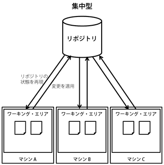
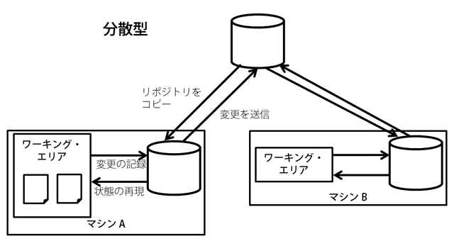

# About Version Control

まずは、バージョン管理の必要性について説明していきます。

## バージョンの管理

それが文章でプログラムであれ、あれ何かものを作っていく際には余程小さな規模のものでない限りいっぺんに作り上げられることは稀です。また、例え一度に作り上げたとしても、後から直したくなることはざらにあることでしょう。

そのような時に要所要所での作業を記録として残しておく、それがバージョン管理の基本的な考え方です。

## 手動で行うバージョン管理

もっとも素朴なバージョン管理手法としては、ファイル名を以てそれがいつの時点のものかを判断することが挙げられます。ただこの場合、最初にきちんとファイルの命名規則を決めておかないと大変なことになることは想像に容易いでしょう。すなわち、`原稿.txt`、`原稿(修正版).txt`、`原稿(訂正版).txt`、`原稿(最新版).txt`のような名前の付け方では果たしてどれが必要としている時点での原稿のファイルなのか分からなくなってしまうのです。

そこで、ファイルの命名を規則的にすることを考えましょう。すなわち、`原稿20140602.txt`、`原稿20140616.txt`のように日付をファイル名の中に入れるのです。

これはなかなか良いアイデアのように思えます。実際、単一のファイルを管理する上ではこの手法でも十分に通用するでしょう。

ただ、この方法にもいくつか欠点が見つかります。まず、あくまで単一のファイルの管理にしか使えないこと、次にどのような変更をしたのかの情報が得られないこと、そして、誤って違うファイルを変更してしまう危険があることです。

原稿が複数の部分で構成されるような場合、一ファイルが大きくなりすぎないよう、（例えば章単位で区切るなど）複数のファイルをもって構成するのはごく自然なことです。一章を1ファイル、`第一章.txt`、`第二章.txt`のような感じですね。

この場合、`第一章20140602.txt`、`第二章20140627.txt`のようなファイルが出てくることになるでしょうが、各々のファイルがどのような関係にあるのかは分かりません。`第一章20140602.txt`が作成された時、第二章がどのような状態だった知るすべがないのです。

もちろん、変更の都度、`**20140703.txt`のように同じ接尾語をつけて全てのファイルをコピーするという考え方もあります。しかし、ただ第一章の内容だけを変更したのに何の変更もない他の章のコピーを作るのは手間ですし、何よりディスク容量も無駄に使ってしまうことになります。

どのような変更をしたのかの情報が得られない、誤って違うファイルを変更してしまう危険がある、というのはそのままの意味で、ただ日付を記録するだけではその意図を汲み取ることはできません。

第一章に書いてみたけど、これは第一章よりももっと後の章に書くべきだったから文章を移動させた、という情報は`第一章20140706.txt`、`第七章20140706.txt`というファイル名からは得られないのです。

また、人間である以上、過去の原稿をたどっているうちに変更をしてしまい、もともとどういう内容だったか分からなくなる、ということも存分にあり得ます。

## VCSの機能
以上のような人の手では混乱を招いたり、ミスが起こったりしてしまうことを代行するのがバージョン管理の機能です。具体的には、バージョン管理システム(VCS)は次のような機能を持ちます。

### いつでも状態をきり戻せる
バージョン管理のもっとも肝となる部分です。ファイルの変更や変更の理由などのコメントを残すことができます。また、後になっていつでも任意の状態にきり戻すことができます。

通常、状態を管理したいプログラムや原稿などのファイルは一つではなく、いくつかをまとめて一つのものとして扱います。VCSを使うことである時点で一連のまとまり(プロジェクトとします)がどのような状態だったか、関連づけて保存しておくことができます。このようなことも手動でバージョン管理を行っていてはできないことです。

### 変更履歴を調べる
変更履歴を調べることができます。「以前の状態に戻したい」となった時に、プロジェクト全てを戻したいことは稀で大抵ある場所の記述を元に戻したいなどの場合がほとんどです。そのような時はファイルの変更を調べていくことになりますが手動でのバージョン管理だと、知りたいファイル間の変更を調べるだけでも大変です。VCSでは「誰が」「いつ」「何を変更したのか」を管理してくれているので容易に調べることができます。

## VCS用語
ここでは、VCSで使われる用語について説明します。本書ではGitのようなシステムをVCS(Version Control System:バージョン管理システム)と呼んでいますが、SCM(Source Code Management)システムやSCCS(Source Code Control System)と呼ばれることもあります。

### リビジョンやコミット
VCSでは「以前の状態に戻る」ことができるように区切りの良い時点でプロジェクトの状態を記録できるようになっています。こうした時点ごとのプロジェクトの状態を記録したものをリビジョン(revision)やコミット(commit)という言葉で呼びます。また、コミットという単語は「コミットする」のように記録を残す動詞としても使われます。

### リポジトリ
プロジェクト開始以来の全てのコミットを集めて記録しているデータベースをリポジトリ(repository)と呼びます。リポジトリ内に記録されたコミット間の関連やあるコミットがどのコミットの次に作られているのかをまとめるとそれがそのままプロジェクトの歴史となることから、リポジトリはプロジェクトの歴史を記録しているということができます。

### ワーキングエリア
実際に変更を行うファイル群のことです。リポジトリはあくまでその時々の状態を記録しているデータベースにすぎません。変更を行うにはリポジトリに記録されているプロジェクトの状態を実際に復元する必要があるのです。

VCSではワーキングエリアにリポジトリに含まれる特定のコミット(通常は最新のものですが)をチェックアウト(checkout)することで変更を行います。

### 集中型と分散型
VCSには、大分して集中型と分散型があります。

集中型はバージョンを単一のマシンで管理する方式のもので、Git登場以前より広く使われているSVNなどがこれにあたります。

特徴として、記録した変更履歴は即全てに反映されること、変更を記録するのにネットワーク接続が必要なことが挙げられます。

一方、分散型はバージョンを管理するマシンが複数台あるものをさします。
特徴として、ネットワーク接続なしに多くの操作が実行できることなどが挙げられます。

Gitは分散型を採用しています。

- ネットワークにつながっていなくても、ローカルなリポジトリに対して作業を続けられる
- 実験的な変更も遠慮なく試すことができる(集中型では、変更はすぐに反映されてしまう)
- 一通りの変更が終わった後、ローカルで履歴を見直し、適切な形に書き直してから公開することができる。

といったGitの利点は分散型システムの持つ特性からきています。
